# Rental Management System Application with MSA
> Rental Management System(RMS)は[Helidon](https://helidon.io/)を使ってマイクロサービスやMicroProfileの利用法や効果を確認することを目的としたリファレンス的なアプリケーションです。このリポジトリはRMSの説明や親pom、GitHub Actionsの共通的なワークフローなどRMS全体で共通となる情報や定義を格納したものになります

# Table of Contents
- [アプリケーション機能](#アプリケーション機能)
- [マイクロサービスの構成](#マイクロサービスの構成)
- [repository構成](#repository構成)
- [システムアーキテクチャ](#システムアーキテクチャ)
- [アプリケーションアーキテクチャ](#アプリケーションアーキテクチャ)
- [MicroProfileを使った主な仕組み](#microprofileを使った主な仕組み)


# アプリケーション機能
RMSは会員がレンタル品を予約するアプリケーションで管理機能としてマスターデータをメンテナンスする機能を持っている。なお、実装している機能は予約まででレンタルを行う機能はまだ持っていない

| 分類 | 機能 | 内容 |
|------|------|------|
|会員機能|レンタル品検索|レンタル品を検索し予約状況の確認ができる|
||レンタル品予約|予約したいレンタル品を選択しレンタル期間を指定した予約ができる|
||予約確認|自分の予約を確認したりキャンセルしたりすることができる|
|管理機能|レンタル品管理|レンタル品の登録や更新などを行うことができる|
||予約管理|登録されたレンタル予約の削除や変更を行うことができる|
||ユーザ管理|ユーザの登録や更新、削除などを行うことができる|
|共通機能|ログイン/ログアウト|システムへのログインとログアウト|
||ユーザプロファイル|ユーザが自分の登録情報を確認、変更ができる|

:information_desk_person: INFO  
手っ取り早く動くものを見たい方は[こちら](https://app.rms.extact.io/)のデモアプリをお試を

# マイクロサービスの構成
RMSは次のアプリケーションから構成されるマイクロサービスアーキテクチャになっている


DBはh2のインメモリデータベースを使ったDatabase per Service構成にしている  

|要素|説明|
|---|----|
|ApiGateway| 主に以下の役割を担う<br>- フロントエンドに対するFacade<br>- フロントエンドとバックエンドのデータモデルの変換<br>- ユーザ認証と後段サービスへの認証情報の伝播|
|RentalItemService|レンタル品を管理するサービス|
|ReservationService|予約を管理するサービス|
|UserService|ユーザを管理するサービス|
|SPAクライアント|ReactによるSPAのUIアプリ|
|CLIクライアント|JavaSEによるコンソールUIアプリ |

なお、SPA,CLIのどちらでもレンタル品の予約や管理を行うことができるが、CLIアプリはSPAアプリよりもできることが少なくなっている。

:warning: WARNIG  
サンプル的な側面があるため小さいサービスでマイクロサービスを構成しているが、実業務でこのような小粒度のサービスをマイクロサービス化することは勧めない。マイクロサービスアーキテクチャで得られるメリットよりもデメリットの方が遥かに大きくなる可能性が高い

# repository構成
RMSを構成する各アプリケーションやライブラリは次のようにマルチレポ形式で管理している

|repository| 説明 |
|----------|------|
|[msa-rms-parent](https://github.com/extact-io/msa-rms-parent)| 親pomや共通的なGitHub Actionsのワークフローなどの共通定義を格納しているこのリポジトリ |
|[msa-rms-platform](https://github.com/extact-io/msa-rms-platform/)| サービスに依らない基盤的な仕組みを提供する。このリポジトリ内だけはMavenのマルチモジュールによるモノレポ形式になっている。詳細はレポジトリの[README](https://github.com/extact-io/msa-rms-platform/README.md)を参照 |
|[msa-rms-apigateway](https://github.com/extact-io/msa-rms-apigateway/)| ApiGatewayを格納するリポジトリ |
|[msa-rms-service-item](https://github.com/extact-io/msa-rms-service-item/)| RentalItemServiceを格納するリポジトリ |
|[msa-rms-service-reservation](https://github.com/extact-io/msa-rms-service-reservation/)| ReservationServiceを格納するリポジトリ |
|[msa-rms-service-user](https://github.com/extact-io/msa-rms-service-user/)| UserServiceを格納するリポジトリ |
|[msa-rms-ui-console](https://github.com/extact-io/msa-rms-ui-console/)| RMSのコンソールアプリを格納するリポジトリ |

## Reactアプリのrepository構成
ReactアプリのrepositoryにはApiGatewayの[ソースコード](/msa-rms-apigateway/src/main/java/io/extact/msa/rms/apigateway/webapi/ApiGatewayResource.java)からMicroProfile OpenAPIで出力したOAS情報(openapi.yml)をもとにOpenAPI Generatorで自動生成したAPI Clientのrepositoryも含まれる。このrepository間の関係は次のとおり



|repository| 説明 |
|---|---|
|[rms-ui-react](https://github.com/extact-io/rms-ui-react)|ReactによるrmsののSPAフロントエンドアプリのリポジトリ |
|[rms-generated-client-js](https://github.com/extact-io/rms-generated-client-js)| OpenAPI Generatorで生成したAPI Clientコードを格納するリポジトリ |
|[msa-rms-apigateway](https://github.com/extact-io/msa-rms-apigateway/)|openapi.ymlを出力するアプリのリポジトリ|

# システムアーキテクチャ
RMSはローカルでも動作するがAWS上の次の構成をアプリのターゲット環境としている。なお、CI/CDにはGitHub ActionsをContainerRegistryにはGitHub Packagesを使っている。

## RMSのシステム全体像


サービスを稼働させるコンテナ環境は次のとおり

|サービス|稼働環境|
|-------|--------|
|ApiGateway|EC2(Installed Docker)|
|RentalItemService|ECS(Fargate)|
|ReservationService|ECS(Fargate)|
|UserService|ECS(Fargate)|

データを管理するサービスはPrivate subnetに配置することのみを必須とし、その他はデモ環境でもあるため、コストを最優先の構成にしている。よって、敢えてシングルAZ構成で高額なALBも利用していない

:information_desk_person: INFO  
実際のアプリのお試しは[こちら](https://app.rms.extact.io/)からどうぞ

:information_source: 関連記事  
・[1日50円で使えるマイクロサービスなアプリを動かすAWS環境を作ってみた | 豆蔵デベロッパーサイト](https://developer.mamezou-tech.com/blogs/2023/05/28/msaapp-on-50yen-aws/)  

## CI/CD環境
上述のとおり、CI/CD環境はすべてGitHubのサービスでまかなっている。

- JavaのコンパイルからコンテナイメージのContainerRegistryへのpushまでの操作はすべてMavenで行いってる
- コンテナイメージのbuildからpushの定義は[親pom](https://github.com/extact-io/msa-rms-parent/blob/main/pom.xml)に[docker-maven-plugin](https://github.com/fabric8io/docker-maven-plugin)を使って行っている
- コンテナイメージのtagはGitHub Actionの[build-to-repo-job.yml](https://github.com/extact-io/msa-rms-parent/blob/main/.github/workflows/build-to-repo-job.yml)でgitのコミットハッシュをつけている
- EC2のDockerコンテナ上で稼働するApiGatewayへのデプロイは[deploy-to-ec2-job.yml](https://github.com/extact-io/msa-rms-parent/blob/main/.github/workflows/deploy-to-ec2-job.yml)でビルドしたコミットハッシュのコンテナイメージを起動するように書き換えたシェルスクリプトをAWS CodeDeployでEC2にデプロイし、コンテナを再起動している
- Fargate上の各サービスのデプロイは[deploy-to-ecs-job.yml](https://github.com/extact-io/msa-rms-parent/blob/main/.github/workflows/deploy-to-ecs-job.yml)でAWS CLIでコンテナのtagをコミットハッシュに書き換えた新しいリビジョンのタスク定義を作成し、サービスを更新することで再デプロイを行っている

:information_source: 関連記事  
・[今さら聞けないMaven – コンテナのビルドと一緒にpushもMavenでしたい。 | 豆蔵デベロッパーサイト](https://developer.mamezou-tech.com/blogs/2023/03/02/docker-push-with-maven/)  


# アプリケーションアーキテクチャ
## 利用ライブラリと準拠API
RMSで利用、採用している主なものは下記のとおり
- ランタイム系
  - Java17（OpenJDK v17.0.3）
  - [MicroProfile 5.0](https://download.eclipse.org/microprofile/microprofile-5.0/microprofile-spec-5.0.html)
  - [Helidon MP 3.2.x](https://helidon.io/docs/v3/#/about/introduction)
  - H2 Database
  - [Text-IO 3.4.1](https://github.com/beryx/text-io) -> コンソールアプリ向けのframework
- テスト系
  - JUnit 5.7
  - [ArchUnit 0.23](https://www.archunit.org/)
  - [Helidon MP Testing with JUnit5](https://helidon.io/docs/v3/#/mp/testing)


## 論理アーキテクチャ
ApiGatwayやReservationServiceなどのバックエンドアプリはいずれも次に示すdomainレイヤをリラックスレイヤにした一般的なレイヤーアーキテクチャを採用している



- webapi・・レンタル予約システムアプリをRESTで外部に公開する
- Serivce・・レンタル予約システムのアプリケーション実装
- domain・・エンティティや制約
- external・・RESTによるアプリ間連携を行う
- persistence・・データの永続化
- platform-fw・・アプリ間で共通となる制御構造や処理の流れを実装したRMS向けフレームワーク
- platform-core・・処理形態および業務依らない基盤的な仕組み

レイヤ間やパッケージやライブラリへの依存関係のルールは[ArchUnitの実装](https://github.com/extact-io/msa-rms/wiki/ArchUnit%E3%81%AB%E3%82%88%E3%82%8B%E3%82%A2%E3%83%BC%E3%82%AD%E3%83%86%E3%82%AF%E3%83%81%E3%83%A3%E5%AE%9A%E7%BE%A9)で細かく定義している

:pushpin: POINT  
Persistenceレイヤは設定を切り替えるだけでFileによる永続化とJPAを使ったRBDへの永続化のどちらでも使えるようにしている  

:information_source: 関連記事  
・[ArchUnitで考えるアーキテクチャ構造とその検証 | 豆蔵デベロッパーサイト](https://developer.mamezou-tech.com/blogs/2022/05/19/archunit-and-architechure/)  


# MicroProfileを使った主な仕組み
MicroProfileの機能を使って実現しているRMSアプリケーションの主な仕組みは以下のとおり

## MicroProfile Config
モジュールごとにデフォルト値を設定した設定ファイルをそれぞれ持ち、実行環境ごとに定義が必要な設定はMicroProfile Configの優先度の仕組みを使い、環境変数で設定を上書きするようにしている。

各モジュールが持つMicroProfile Configの設定ファイルと優先度は次のとおり

|モジュール|設定ファイル|優先度|内容|
|---------|-----------|-----|----|
|(環境変数) | ([docker_run](https://github.com/extact-io/msa-rms-apigateway/blob/main/env/deployment/scripts/docker_run.sh)) | 300 | `rms.*`で定義している設定キーは実行環境ごとに環境変数で上書きされることを期待している |
|apigateway| [application.yaml](https://github.com/extact-io/msa-rms-apigateway/blob/main/src/main/resources/application.yaml) | 100 | apigateway向けの設定を定義 |
|item-service| [application.yaml](https://github.com/extact-io/msa-rms-service-item/blob/main/src/main/resources/application.yaml) | 100 | item-service向けの設定を定義 |
|reservation-service| [application.yaml](https://github.com/extact-io/msa-rms-service-reservation/blob/main/src/main/resources/application.yaml) | 100 | reservation-service向けの設定を定義 |
|user-service| [application.yaml](https://github.com/extact-io/msa-rms-service-user/blob/main/src/main/resources/application.yaml) | 100 | user-service向けの設定を定義 |
|console-ui| [application.yaml](https://github.com/extact-io/msa-rms-ui-console/blob/main/src/main/resources/application.yaml) | 100 | console-ui向けの設定を定義 |
|platform-fw | [application.yaml](https://github.com/extact-io/msa-rms-platform/blob/main/platform-fw/src/main/resources/application.yaml) | 50 | fwが持つ機能のデフォルト動作などを定義 |
|platform-core| [application.yaml](https://github.com/extact-io/msa-rms-platform/blob/main/platform-core/src/main/resources/application.yaml) | 30 | coreが持つ機能のデフォルト動作などを定義 | 

パスフレーズなどの機密情報はターゲット環境のセキュアな領域に配置された定義を読み込むようにしている。なお、MicroProfile Configの[Config Profile](https://download.eclipse.org/microprofile/microprofile-config-3.0.1/microprofile-config-spec-3.0.1.html#configprofile)機能はYAMLが使えないなど使いづらい部分があるため使用していない

:information_source: 関連記事  
・[お手軽便利MicroProfile Config | 豆蔵デベロッパーサイト](https://developer.mamezou-tech.com/msa/mp/cntrn06-mp-config/)  
・[MicroProfile Config 3.0へのキャッチアップ | 豆蔵デベロッパーサイト](https://developer.mamezou-tech.com/msa/mp/cntrn08-mp-config3/)


## MicroProfile Rest Client
RMSでは次の箇所でMicroProfile Rest Clientの機能を使っている

- REST呼び出し(RestClinetインタフェース)
  - 例えばApiGatwayからReservationServiceの呼び出しは[ReservationApiRestClient](https://github.com/extact-io/msa-rms-apigateway/blob/main/src/main/java/io/extact/msa/rms/apigateway/external/restclient/ReservationApiRestClient.java)で、ReservationServiceからRentalItemServiceへの呼び出しは[RentalItemCheckApiRestClient](https://github.com/extact-io/msa-rms-service-reservation/blob/main/src/main/java/io/extact/msa/rms/reservation/external/restclient/RentalItemCheckApiRestClient.java)で行っている
  - 他についてもRMSではMicroProfile Rest ClientのRestClientインタフェースを使って対向サービスへのREST呼び出しを行っている
- REST呼び出しにおけるHTTPヘッダの設定(ClientHeadersFactory)
  - ApiGatwayと各サービス間は閉域ネットワークのため、ApiGatewayから各サービスに伝播する認証情報はMicroProfile Rest ClientのClientHeadersFactoryを実装した[PropagateLoginUserClientHeadersFactory](https://github.com/extact-io/msa-rms-platform/blob/main/platform-fw/src/main/java/io/extact/msa/rms/platform/fw/external/PropagateLoginUserClientHeadersFactory.java)でHTTPヘッダーに平文で設定を行っている
  - Console-UIはサーバーで発行されたIDトークン(JWT)を常にAuthorizationヘッダに設定する必要があるがこれについても、ClientHeadersFactoryを実装した[PropagateJwtClientHeadersFactory](https://github.com/extact-io/msa-rms-platform/blob/main/platform-fw/src/main/java/io/extact/msa/rms/platform/fw/external/PropagateJwtClientHeadersFactory.java)で行っている
- REST呼び出しに対する例外ハンドリング(ResponseExceptionMapper)
  - Responseのステータスコードが400番台や500番台のエラーを示している場合、アプリにはそのエラーに応じた例外を返却するようにMicroProfile Rest ClientのResponseExceptionMapperを使い、[PropagateResponseExceptionMapper](https://github.com/extact-io/msa-rms-platform/blob/main/platform-fw/src/main/java/io/extact/msa/rms/platform/fw/external/PropagateResponseExceptionMapper.java)でResponseに対するエラーハンドリングを一元的に行っている

:information_source: 関連記事  
・[らくらくMicroProfile RestClient | 豆蔵デベロッパーサイト](https://developer.mamezou-tech.com/msa/mp/cntrn07-mp-restclient/)  
・[MicroProfile RestClient 3.0の確認と小技機能の紹介 | 豆蔵デベロッパーサイト](https://developer.mamezou-tech.com/msa/mp/cntrn11-mp-restclient3/)


## MicroProfile OpenAPI
### <OAS情報の定義>
RMSではMicroProfile OpenAPIを使いソースコードをもとにOAS(openapi.yml)を生成するスキーマファーストではなく、ソースコードを起点にしたボトムアップアプローチを採っている

具体的にはアプリケーションに固有なAPI情報はアプリのRESTインタフェースにMicroProfile OpenAPIのアノテーションを使いOAS情報を定義している。このアノテーションが使われているアプリのインタフェースは次のとおり

 - [LoginResource](https://github.com/extact-io/msa-rms-apigateway/blob/main/src/main/java/io/extact/msa/rms/apigateway/webapi/LoginResource.java)
 - [ApiGatewayResource](https://github.com/extact-io/msa-rms-apigateway/blob/main/src/main/java/io/extact/msa/rms/apigateway/webapi/ApiGatewayResource.java)
 - [RentalItemResource](https://github.com/extact-io/msa-rms-service-item/blob/main/src/main/java/io/extact/msa/rms/item/webapi/RentalItemResource.java)
 - [ReservationResource](https://github.com/extact-io/msa-rms-service-reservation/blob/main/src/main/java/io/extact/msa/rms/reservation/webapi/ReservationResource.java)
 - [UserAccountResource](https://github.com/extact-io/msa-rms-service-user/blob/main/src/main/java/io/extact/msa/rms/user/webapi/UserAccountResource.java)

これに対しエラーステータスなどアプリで共通となる情報はplatform-fwの[CommonOpenApiModelReader](https://github.com/extact-io/msa-rms-platform/blob/main/platform-fw/src/main/java/io/extact/msa/rms/platform/fw/webapi/openapi/CommonOpenApiModelReader.java)でMicroProfile OpenAPIのプログラムAPIを使いコードでOAS情報を定義し、それを各アプリが参照する形にしている

また、OASで扱う共通的な型情報については、platform-coreの[application.yaml](https://github.com/extact-io/msa-rms-platform/blob/main/platform-core/src/main/resources/application.yaml)でMicroProfile OpenAPIの設定機能で行っている

### <OAS情報の生成>
MicroProfile OpenAPIは`/openapi`のリクエストに対しソースコードの情報をもとにリアルタイムでOAS情報(openapi.yml)を生成してレスポンスとして返す。このため、OpenAPI Generatorでopenapi.ymlファイルをもとにコード生成を行う場合、あらかじめ`/openapi`のレスポンスをファイルに出力しておく必要がある。

RMSでは`/openapi`を呼び出してファイル出力する[GenerateOasFileTest](https://github.com/extact-io/msa-rms-apigateway/blob/main/src/test/java/io/extact/msa/rms/apigateway/webapi/GenerateOasFileTest.java)を用意し、このテストクラスを使ってopenapi.ymlを生成するようにしている

### <OAS情報の参照>
Helidonの独自機能となるが[OpenAPI UI](https://helidon.io/docs/v3/#/mp/openapi/openapi-ui)機能を使うことで、`/openapi`のレスポンスを[こちら](https://api.rms.extact.io/openapi/ui/index.html)のようなswagger-uiで簡単にみることができる


:information_source: 関連記事  
・[コードが仕様の源泉MicroProfile OpenAPI | 豆蔵デベロッパーサイト](https://developer.mamezou-tech.com/msa/mp/cntrn05-mp-openapi/)  
・[MicroProfile OpenAPI 3.0の新機能と既存機能の比較 | 豆蔵デベロッパーサイト](https://developer.mamezou-tech.com/msa/mp/cntrn09-mp-openapi3/)

## MicroProfile JWT Auth
RMSではID/Passwordによる独自のログイン機能を用意し、ログイン成功時にJWTを発行し、クライアントは以降のリクエストではAuthorizationヘッダのbearerトークンに発行されたJWTを設定する。これに対しサーバーサイドは認証配下のリクエストに対し常にJWT認証を行う

RMSではこのJWT認証にMicroProfile JWT Authの機能を使って実現している。MicroProfile JWT Authを利用する上で必要な実装はなく、[ApiGatewayApplication](https://github.com/extact-io/msa-rms-apigateway/blob/main/src/main/java/io/extact/msa/rms/apigateway/webapi/ApiGatewayApplication.java)のように認証配下とするRESTリソースを管理するJAX-RSのApplicationクラスに`@LoginConfig(authMethod = "MP-JWT")`を付けるだけとなる

また、MicroProfile JWT Authとは関係ないが、ログイン成功時にJWTを発行する仕組みはplatform-coreの[jwtパッケージ](https://github.com/extact-io/msa-rms-platform/tree/main/platform-core/src/main/java/io/extact/msa/rms/platform/core/jwt)に、そして発行されたJWTをクライアントに伝播させる仕組みはplatform-fwの[loginパッケージ](https://github.com/extact-io/msa-rms-platform/tree/main/platform-fw/src/main/java/io/extact/msa/rms/platform/fw/login)に実装している

JWTを生成する処理は[Auth0 java-jwt](https://github.com/auth0/java-jwt)を使った[Auth0RsaJwtGenerator](https://github.com/extact-io/msa-rms-platform/blob/main/platform-core/src/main/java/io/extact/msa/rms/platform/core/jwt/provider/impl/Auth0RsaJwtGenerator.java)と[jose4j](https://bitbucket.org/b_c/jose4j/wiki/Home)を使った[Jose4jRsaJwtGenerator](https://github.com/extact-io/msa-rms-platform/blob/main/platform-core/src/main/java/io/extact/msa/rms/platform/core/jwt/provider/impl/Jose4jRsaJwtGenerator.java)を用意している

:information_source: 関連記事  
・[基本から理解するJWTとJWT認証の仕組み | 豆蔵デベロッパーサイト](https://developer.mamezou-tech.com/blogs/2022/12/08/jwt-auth/)  
・[MicroProfile JWT Authがやってくれること・できること | 豆蔵デベロッパーサイト](https://developer.mamezou-tech.com/msa/mp/cntrn17-mp-jwt/)  
・[Auth0 java-jwtを使った素のJWT認証 | 豆蔵デベロッパーサイト](https://developer.mamezou-tech.com/blogs/2022/12/10/java-jwt-auth/)  
・[続・Auth0 java-jwtを使った素のJWT認証 - 公開鍵方式でやってみた | 豆蔵デベロッパーサイト](https://developer.mamezou-tech.com/blogs/2022/12/25/rsa-java-jwt/)


## MicroProfile Health
RMSではコンテナに対する独自のヘルスチェックコマンドとして、MicroProfile HealthのReadiness Probeを実装している

DBを持つサービスにはping sqlを発行し、DBの死活状態を確認する[DbReadinessCheck](https://github.com/extact-io/msa-rms-platform/blob/main/platform-core/src/main/java/io/extact/msa/rms/platform/core/health/DbReadinessCheck.java)を、そしてApiGatewayのように他のサービスへ連携を行うサービスについては、設定で定義されたすべての連携先に対してReadiness Probe(`/health/ready`)を行いすべてOKなら自身のステータスもOKとする[ReadinessOfOutboundServersHealthCheck](https://github.com/extact-io/msa-rms-platform/blob/main/platform-core/src/main/java/io/extact/msa/rms/platform/core/health/ReadinessOfOutboundServersHealthCheck.java)を用意している

:information_source: 関連記事  
・[MicroProfile Healthの機能と利用 | 豆蔵デベロッパーサイト](https://developer.mamezou-tech.com/msa/mp/cntrn10-mp-health/)

## MicroProfile Metrics
RMSでの利用はなし  
（MicroProfile Metricsがデフォルトで取集するメトリクスに対するGrafanaの素敵なダッシュボードがないため。誰か作って・・）

:information_source: 関連記事  
・[MicroProfile Metricsの機能と利用 | 豆蔵デベロッパーサイト](https://developer.mamezou-tech.com/msa/mp/cntrn15-mp-metrics/)

## MicroProfile OpenTracing
RMSではMicroProfile OpenTracingとJaegerで分散トレース情報の収集と参照を行っている

MicroProfile OpenTracingの利用は簡単で、必要なライブラリをアプリケーションに組み込むだけで利用可能となる。よって、通常の利用方法において必要となる実装はない

ただし、RMSでは一部非同期によるREST呼び出しを行っている箇所があり、この箇所におけるトレース情報の伝播がMicroProfile OpenTracingのデフォルトの機能では行われないため、MicroProfile OpenTracingのAPIを使って、マニュアルでトレース情報を対向システムに伝播するようにしている。この実装は[ReservationGwService](https://github.com/extact-io/msa-rms-apigateway/blob/main/src/main/java/io/extact/msa/rms/apigateway/service/ReservationGwService.java)のcomposeModelメソッドで行っている

なお、RMSの実際の分散トレースは[こちら](http://api.rms.extact.io:16686/search)から参照することができる

:information_source: 関連記事  
・[MicroProfile OpenTracingとJaegerで理解する分散トレーシング | 豆蔵デベロッパーサイト](https://developer.mamezou-tech.com/msa/mp/cntrn16-mp-tracing/)


## MicroProfile Fault Tolerance
RMSでは、REST連携する対向システムがダウンしている際に未処理のリクエストが溜まり連鎖的に障害が発生することを防ぐため、[RentalItemApiProxy](https://github.com/extact-io/msa-rms-apigateway/blob/main/src/main/java/io/extact/msa/rms/apigateway/external/proxy/RentalItemApiProxy.java)などREST連携を行う箇所でサーキットブレーカーを下記のように設定している

```java
@NetworkConnectionErrorAware
@CircuitBreaker(
        requestVolumeThreshold = 4, 
        failureRatio=0.5, 
        delay = 10000, 
        successThreshold = 3,
        failOn = RmsNetworkConnectionException.class)
public class RentalItemApiProxy implements RentalItemApi {..
```
この設定内容は次のとおり
1. `@NetworkConnectionErrorAware`によりネットワークエラーは`RmsNetworkConnectionException`に変換される
2. `RmsNetworkConnectionException`を失敗としてカウントし、それ以外の例外が発生しても失敗にはカウントしない
3. 直近処理した4件の失敗率が0.5、つまり2件以上であった場合にサーキットブレーカーをopenにし、以降10秒間のメソッド呼び出しに対しては`CircuitBreakerOpenException`を送出する
4. 10秒経過後、3回連続して処理が成功した場合、つまり`CircuitBreakerOpenException`以外が返却された場合に正常状態に復帰する
5. 3回連続する前に処理が1度でも失敗した場合は、3.に戻り同様の制御を繰り返し行う

:information_source: 関連記事  
・[MicroProfile Fault Tolerance(1) - 例で理解する基本機能編 | 豆蔵デベロッパーサイト](https://developer.mamezou-tech.com/msa/mp/cntrn12-mp-faulttolerance1/)  
・[MicroProfile Fault Tolerance(2) - 例で理解する非同期編 | 豆蔵デベロッパーサイト](https://developer.mamezou-tech.com/msa/mp/cntrn13-mp-faulttolerance2/)  
・[MicroProfile Fault Tolerance(3) - 例で理解する設定編 | 豆蔵デベロッパーサイト](https://developer.mamezou-tech.com/msa/mp/cntrn14-mp-faulttolerance3/)


